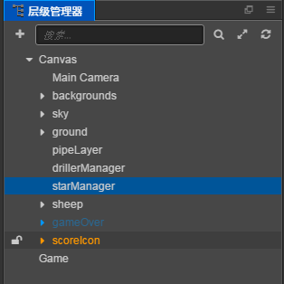
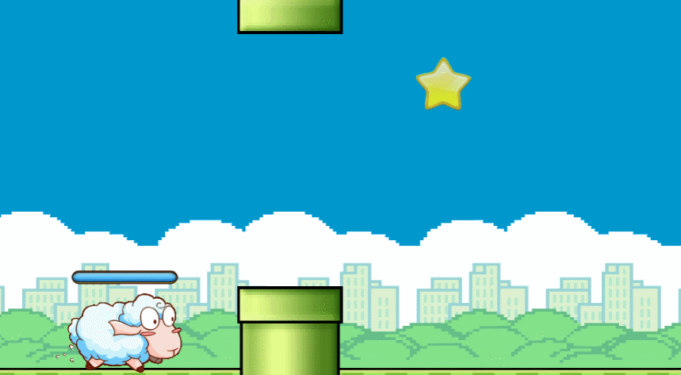

## Duang Sheep项目介绍:

这是一个类似 flappy bird 的小游戏，主人公为一只会飞的绵羊。玩家可以通过点击屏幕操作绵羊进行跳跃避免绵羊撞上障碍物,
越过一个障碍物可得一分，最后看看谁得到的分数最多。<br>

__游戏完成图：__<br>

---
## Git路径:

  >基础项目（资源）： https://github.com/cocos-creator/tutorial-duang-sheep/tree/step-1<br>
  >完整项目（资源 or 脚本）： https://github.com/cocos-creator/tutorial-duang-sheep/tree/master<br>
  
----
### Step6:

上一步内容几乎完成了整个游戏的构造，相信你的游戏已经可以正式的运行起来并且他看起来应该还不错。这一节我们再做最后一个功能，超人模式！<br>

__本章重点:__
- 小星星生成
- sheep 超人模式
- 地图配合产生快速行进效果

1. 首先我们创建新的 Star prefab 作为进入超人模式的诱因。制作过程和之前制作 Driller 和 PipeGroup 方案一致。完成之后在场景内创建一个新的小星星生成器，用于管理(详细的代码以及属性设置参照工程)。 <br>
    <br>
之后在 Sheep onCollisionEnter 函数中添加我们针对 Star 的物体碰撞的处理函数 enterInvincible。
1. 接下来我们分析一下超人模式我们需要的效果：
   - 绵羊停止针对碰撞体的检测可以无伤通过各种障碍物。
   - 绵羊的动画变为机器人的风格。
   - 并且我们需要有变身时间的限制。
   - 最后还需要场景配合，场景的相对运动速度也会加快，而场景内物体有：Background（包含 Sky 和 ground）, PipeGroup, Star, Driller。 <br>
  首先背景画面我们暂时不做调整，觉得有兴趣的话，可以自行尝试修改移动速度。目前我们只调整场景中那些可移动的小物件，Star，Pipe，Driller 它们是由各自的生成器定时生成出现的，生成器中我们使用 __schedule__ 控制时差（如果对 Schedule 组件不是很了解，建议查看官网 [Schedule 手册](https://docs.cocos.com/creator/manual/zh/scripting/scheduler.html)），那么随着场景效果加快，__生成的速率__ 也要相对的加快才能保证场景中不会出现一段长时间无障碍的违和地段。同时各个小物体的 __移动速率__ 也要加快，才能保证整个场景的相对稳定，而不是出现一段障碍物堆积在一起的违和地段。
  ```
    // Invincible 
    enterInvincible () {
        this.invincible = true;
        this._updateAnimation();
        this.unschedule(this._bindedScheduleFunc);
        var timeScale = this.invincibleSpeed / this.normalSpeed;
        // 提高场景内物体的移动速度
        this.increaseSceneSpeed();
        // 设置减速的时机
        this.scheduleOnce(this._bindedScheduleFunc, this.invincibleTime * timeScale);
        // 无敌后，场景运行速度会加快，所以要把 scheduler 的速度也加快，这样才能保证水管的间距不变
        cc.director.getScheduler().setTimeScale(timeScale);
    },
  ```
  因为涉及到各个生成组件，而当前的生成组件我们统一的在 GameManager 中设置了引用，因为，为了减少重复引用，我们直接获取 gameManager 中的组件对象效果是一样的。（如果不知道为什么 GameManager 要获取各个生成器组件，建议返回上一节查看详细解释）。<br>
3. 加快部分分析完毕，减速部分我们只需要按照加速的模式反向调整数值，将数值调整回原设置就可以了（详细的代码建议查看工程）。
   最后实现效果：<br>
    <br>
4. 现在工程的所有功能就基本上完成，但是代码上仍然有些许的不足，比如各个生成器之间重复的代码，以及资源管理方面，对于离开场景物体的未做处理，还有各个模块之间的相互引用造成的引用代码的冗余。这些内容我们将在下一节单独抽出一章进行重构的讲解。

- Step5: https://github.com/cocos-creator/tutorial-duang-sheep/tree/step-5
- Step7: https://github.com/cocos-creator/tutorial-duang-sheep/tree/step-7