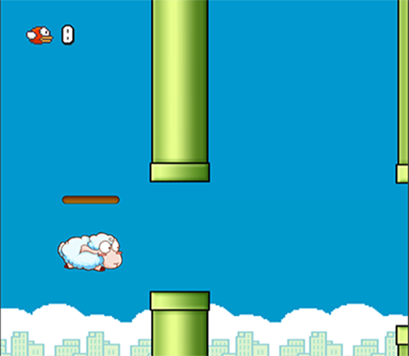
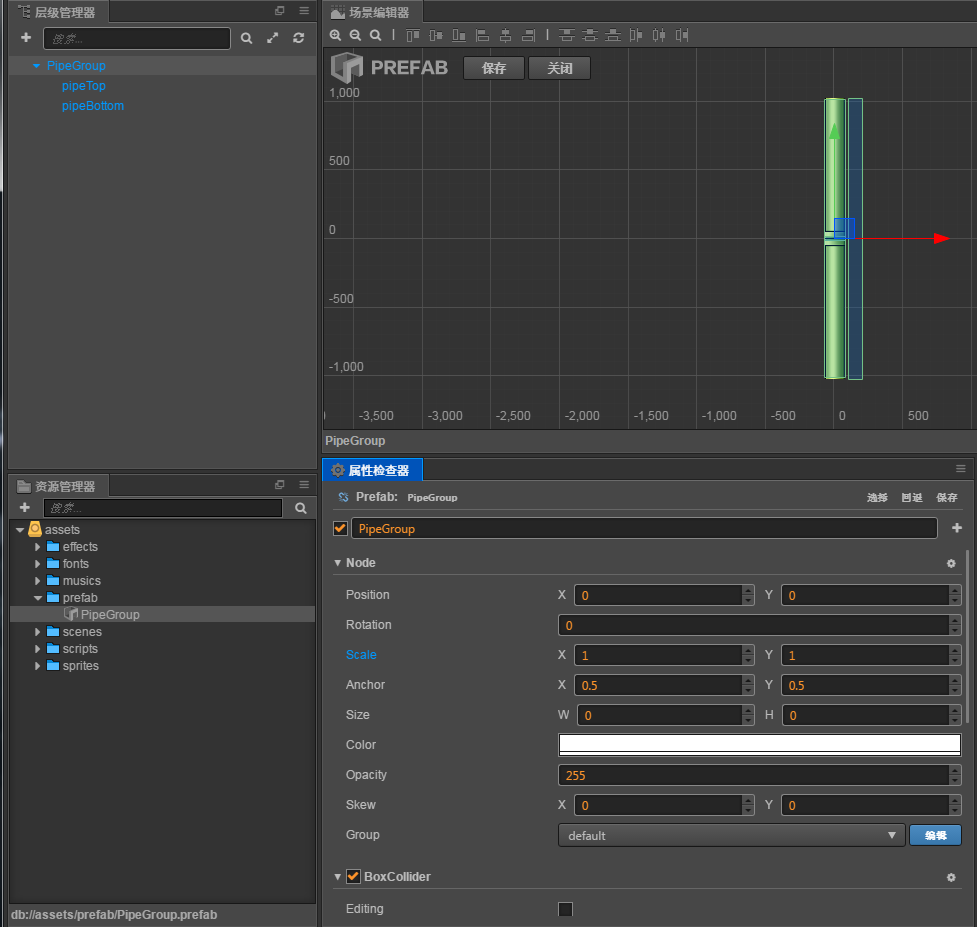
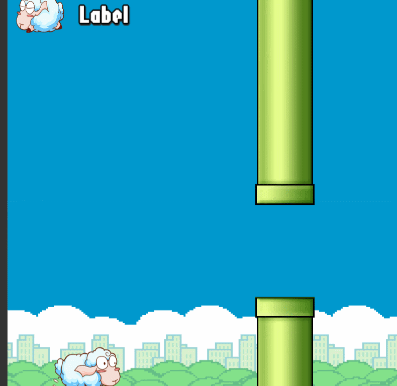

## Duang Sheep项目介绍:

这是一个类似 flappy bird 的小游戏，主人公为一只会飞的绵羊。玩家可以通过点击屏幕操作绵羊进行跳跃避免绵羊撞上障碍物,
越过一个障碍物可得一分，最后看看谁得到的分数最多。

---
## Git路径:

  >基础项目（资源): git@github.com:fireball-x/tutorial.git  
  >完整项目（资源or脚本: git@github.com:fireball-x/tutorial.git
  
----
### Step3:

在上一步 __step2__ 中我们成功的搭建了简单的场景，同时是场景可以不断的位移产生小绵羊正在移动的效果。在这一步中我们进行障碍物的生成。

####第一步：
新建两个我们需要的脚本：__PipeGroup.js,PipeGroupManager.js__ （脚本内容详见工程文件夹）。
PipeGroup: 用于控制 Pipe 位置。正如完成图中展示的，上下管道的位置是会随意生成的。
PipeGroupManager: 用于控制 PipeGroup 的生成，目前暂时先这样设定，到了后续我们将会对 Manager 脚本采取更加合理的方式。但是饭要一口口吃，我们先让这个画面的 barrier 机制运行起来！

####第二步：
1. 场景内创建一个新的 pipeLayer 节点作为 PipeGroup 们的父节点，将 PipeGroupManager.js 绑定上去。
2. 创建新的 Prefab: PipeGroup.prefab 并且绑定 PipeGroup 到 PipeGroup 节点上，具体的参数参考工程内设置。

####第三步：
预览场景，反复检测 bug 至场景正常运行且无报错。
