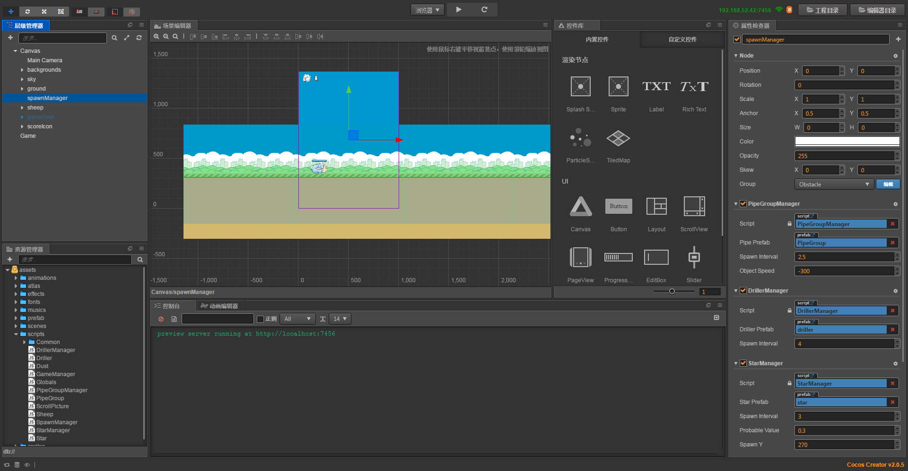

## Duang Sheep项目介绍:

这是一个类似 flappy bird 的小游戏，主人公为一只会飞的绵羊。玩家可以通过点击屏幕操作绵羊进行跳跃避免绵羊撞上障碍物,
越过一个障碍物可得一分，最后看看谁得到的分数最多。<br>

__游戏完成图：__<br>

---
## Git路径:

  >基础项目（资源）： https://github.com/cocos-creator/tutorial-duang-sheep/tree/step-1<br>
  >完整项目（资源 or 脚本）： https://github.com/cocos-creator/tutorial-duang-sheep/tree/master<br>
  
----
### Step7: 
在上一章基本完成了整个项目的整体架构，相信各位已经可以完美的运行自己的游戏项目了，这一章我们主要对代码部分进行一个比较大的重构以及优化。

__本章重点:__ <br>
- 去除重复繁琐代码
- 代码结构优化
- 性能优化 <br> 
1. 首先在 GameManager.js 以及 Sheep.js 代码中我们都对非自身 Component 进行了大量的引用，在本次的重构过程中我想首先对这一部分进行剔除，大量的 Component 获取引用可能会导致不必要的性能浪费，同时从代码上看我们还做了不少临时的共有节点绑定，太麻烦了！当一个类被其他脚本引用到两次以上，我们就可以尝试将它作为一个公共类或者公共对象进行存储。<br>
   因此我们创建 Global.js 代码，通过 window 设置 D 对象作为全局对象并保存我们需要的几个公共对象，比如 DrillerManager.js, GameManager.js 等。<br>

  ```
   // 这里涉及的是 web 端的一个小技巧，window 对象作为默认全局对象存在。
   window.D = {
    // types
    GameManager: null,
    // singletons
    game: null,
    pipeManager: null,
    spawnManager: null,
    starManager: null,
    drillerManager: null,
    sheep: null,
  };
  ```
  <br>
2. 去除了大量对象 properties 中对不同 "Manager" 的引用之后, 去除几个生成器对象多余的 require，并且将它们之间大量重复的代码进行整合，构成一个新的对象—— SpawnManager.js。<br>
  这一步相对来说比较重要，所以我们重点解析一下。首先是关于重复代码的概念，重复代码是指一段具有相同或者具有相似定义功能的代码，当你在编写代码时，尤其是针对新手而言，可能经常会书写大量功能相同或者相似的代码片段，这部分内容是我们在代码编辑后期最不想看到的，不仅浪费存储空间，并且还要浪费时间编辑。因此当你发现有部分代码是你可以反复利用的，那么就把它封装成一个函数设置需要的传参，不仅简洁，并且良好的函数命名还能够帮助你快速理解代码内容。<br>
  对于当前案例而言，重复代码集中存在于几个生成器上，接下来举个详细的例子来看：<br>

  ```
  spawnPipe () {
        let pipe = cc.instantiate(this.pipePrefab);
        let comp = pipe.getComponent(PipeGroup);

        this.node.addChild(pipe);
        pipe.x = this.spawnX;

        return comp;
    },
  // or 
    update (dt) {
        if (D.game.state !== D.GameManager.State.Run) {
            return;
        }
        var children = this.node.children;
        let distance = dt * this.objectSpeed;
        for (var i = 0; i < children.length; i++) {
            var node = children[i];
            node.x += distance;
            var bounds = node.getBoundingBoxToWorld();
            var disappear = bounds.xMax < 0;
            if (disappear) {
                node.destroy();
            }
        }
    },
  ```
  <br>
  这是管道生成以及移动代码，你可以查看 Star 以及 Driller 生成器是否具有相似的代码片段，当确认是重复代码，那么我们就开始封装函数，对于这种多个不同对象具有相同或者相似方法，处理手段就相对简单，一重新创建新类使这几个对象继承新类，二是非继承式调用，即创建新的对象，复数现有对象共同调用新建对象的公共方法。两种方式具体情况具体分析，在当前案例中我们使用第二种（有兴趣的朋友可是尝试改造成为第一种）,最后诞生 SpawnManager.js。<br>

  合成了通用方法之后还记得需要针对不同情况对现实进行调整，这样整合的部分就算是完成了（详细的代码内容详见工程）。 <br>
3. 完成了重复代码整合，那么之后我们需要开始对性能进行优化啦。 Creator 给用户提供了一个 NodePool 帮助用户存储反复使用的节点对象。反复使用的节点对象，意味着重复的生成以及销毁同时也意味着性能的损耗，这是我们实际开发中需要注意的，引擎在创建对象时是十分消耗性能的。
   如果你对 NodePool 的属性还不是很熟悉，建议参考官网的 [NodePool API](https://docs.cocos.com/creator/api/zh/classes/NodePool.html) 以及 [NodePool 手册](https://docs.cocos.com/creator/manual/zh/scripting/pooling.html) 文档。
   ```
   // 初始化 NodePool
    onLoad () {
        D.spawnManager = this;
        // init pool
        this._pool = new cc.js.Pool((obj) => {
            console.log('clear obj success');
        }, 10);

        this._pool.get = this.getCompObj;
    }
   ```
  我们将创建以及销毁等重复利用代码都封装成为一个函数，当一部分功能可以作为独立 API 存在，比如 get/set 方法，通常直接将他们封装成一个函数更加的直观，具有独立逻辑结构的代码单独封装也更容易被调用同时通过函数命名使得代码更加的清晰。<br>
  ```
    spawn (prefab, compType, parent) {
          // pop into pool
          let comp = this._pool.get(compType);
          if (!comp) {
              comp = cc.instantiate(prefab).getComponent(compType);
          }

          if (parent) {
              comp.node.parent = parent;
          }
          else {
              this.node.addChild(comp.node);
              comp.node.x = this.spawnX;
          }
          comp.node.active = true;
          return comp;
      },

      despawn (node) {
        // push
        node.removeFromParent();
        node.active = false;
        let comps = node.getComponents(cc.Component);
        this.putIntoPool(comps[comps.length - 1]);
    },
  ```
  关于生成器部分的重构优化重点差不多就这么多，更加细节的部分需要通过观察工程内代码自行理解,这里就不做更多解释了。 <br>
4. 既然我们已经创建了一个 SpawnManager，那么为了简化场景，我们将场景中的三个单独的生成器都去除，重新创建一个 SpawnManager 节点，绑定这四个和生成相关脚本。<br>
   <br>
5. 整合代码之后不要忘记调整调用这几个对象的类，尤其是 Sheep.js 在上一节中我们实现超人模式对各个生成器都进行了速率操控，因此记得调整代码（详细内容参考工程内部）。 <br>
6. 最后还记得第五节时我们提到的 cc.director.pause API 嘛，若你对 director 这个对象还不是很熟悉建议查看官方 [Director API](https://docs.cocos.com/creator/api/zh/classes/Director.html) 文档。
这一节里面我对重新开始游戏代码也进行了部分调整，你可以通过对比感受之前的 reset 方案与当前的 resume 方案哪个更加的便利。
```
//-- 背景音效停止，死亡音效播放
    gameOver () {
        this.state = State.Over;
        // 游戏主循环暂停
        cc.director.pause();

    /*      
        // stop spwan
        D.pipeManager.reset();
        D.starManager.reset();
        D.drillerManager.reset();
        // stop audio
        cc.audioEngine.stopMusic();
        cc.audioEngine.stopEffect(this.dieAudio);
        cc.audioEngine.stopEffect(this.gameOverAudio); 
    */
        this.gameOverMenu.active = true;
        this.gameOverScoreLabel.string = this.score;
    },
```

__Step6:__ https://github.com/cocos-creator/tutorial-duang-sheep/tree/step-6