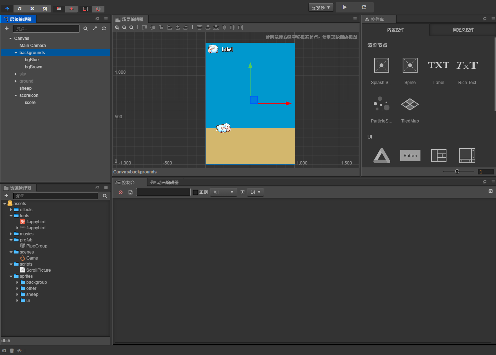
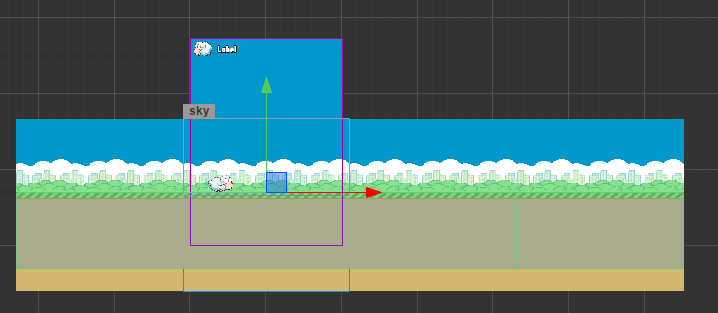
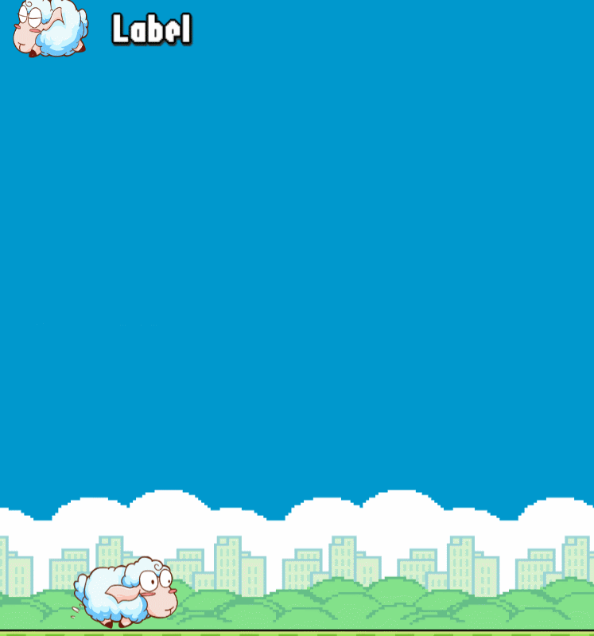

## Duang Sheep项目介绍:

这是一个类似 flappy bird 的小游戏，主人公为一只会飞的绵羊。玩家可以通过点击屏幕操作绵羊进行跳跃避免绵羊撞上障碍物,
越过一个障碍物可得一分，最后看看谁得到的分数最多。
游戏完成图：

---
## Git路径:

  >基础项目（资源): git@github.com:fireball-x/tutorial.git  
  >完整项目（资源or脚本: git@github.com:fireball-x/tutorial.git
  
----
## Step2:
1. 初始化场景如下图（详细配置参照项目工程）。

2. 创建一个新的脚本 ScrollPicture.js。
这个脚本用于控制背景画面的移动，虽然我们现在的背景只是一蓝一黄的 Sprite。
3. 在场景中创建 sky 节点以及 group 节点，并且创建几个子节点，让整体画面呈现如图（详细配置参照项目工程）：

4. 将 ScrollPicture.js 绑定到对应父节点上，并且按照合适的速度调整地面移动速度，最后我们算是初步完成了场景的搭建任务。
