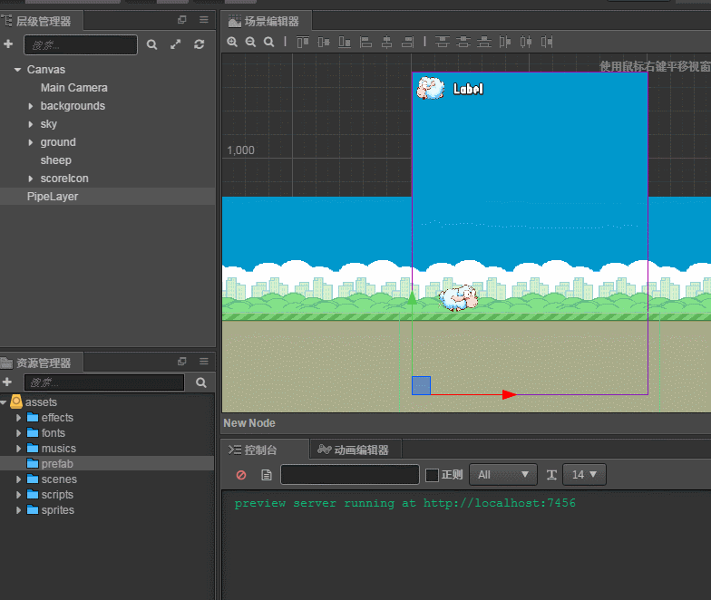
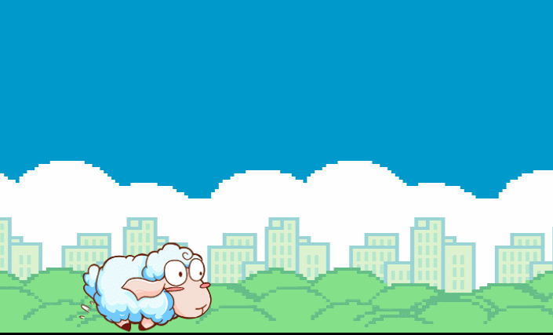

## Duang Sheep项目介绍:

这是一个类似 flappy bird 的小游戏，主人公为一只会飞的绵羊。玩家可以通过点击屏幕操作绵羊进行跳跃避免绵羊撞上障碍物,
越过一个障碍物可得一分，最后看看谁得到的分数最多。<br>

__游戏完成图：__ <br>


---
## Git路径:

  >基础项目（资源）： https://github.com/cocos-creator/tutorial-duang-sheep/tree/step-1<br>
  >完整项目（资源 or 脚本）： https://github.com/cocos-creator/tutorial-duang-sheep/tree/master<br>
  
---
### Step3:
在上一步 __step2__ 中我们成功的搭建了简单的场景，同时也完成了场景的滚动播放并产生小绵羊似乎正在移动的效果。在这一步中我们进行障碍物的生成。<br>

__本章重点:__ <br>
创建 PipePrefab，并且创建一个生成器用于生产 Pipe 作为障碍物。
如果你对 [Prefab](https://docs.cocos.com/creator/manual/zh/asset-workflow/prefab.html) 有什么不了解，可以到到官网的手册中查看详细信息。<br>
1. 首先在资源管理器新建两个我们需要的脚本：__PipeGroup.js，PipeGroupManager.js__ （脚本内容详见工程文件夹）。
- PipeGroup: 用于控制 Pipe 位置。正如完成图中展示的，上下管道的位置是会随意生成的。
  ```
  // 控制生成新的 Pipe 时，上下管道位置与空隙
      onEnable () {
        let botYPos = this.botYRange.x + Math.random() * (this.botYRange.y - this.botYRange.x);
        let space = this.spacingRange.x + Math.random() * (this.spacingRange.y - this.spacingRange.x);
        let topYPos = botYPos + space;
        this.topPipe.y = topYPos;
        this.botPipe.y = botYPos;
    }
  ```
- PipeGroupManager: 用于控制 PipeGroup 的生成，目前暂时先这样设定，到了后续我们将会对生成器脚本采取更加合理的管控方式。但是饭要一口口吃，我们先让这个画面的 barrier 机制运行起来！<br>
2. 场景内右键重新创建一个节点命名为 pipeLayer 作为 PipeGroup 的父节点，将 PipeGroupManager.js 绑定上去。<br>
3. 如图中创建相同，在当前游戏场景中按照如上节点树创建好对象之后，将 node 从节点树拖拽到资源管理器中的 Prefab 文件夹下（如果你没有 prefab 文件夹，记得新建哦）。
  <br>
4. 记得给父子节点绑定如图中显示对应的 BoxCollider（详细数值可以参考一下工程内设定）。
 <br>
5. 预览场景，反复检测 bug 至场景正常运行且无报错。<br>
   

- Step2: https://github.com/cocos-creator/tutorial-duang-sheep/tree/step-2
- Step4: https://github.com/cocos-creator/tutorial-duang-sheep/tree/step-4