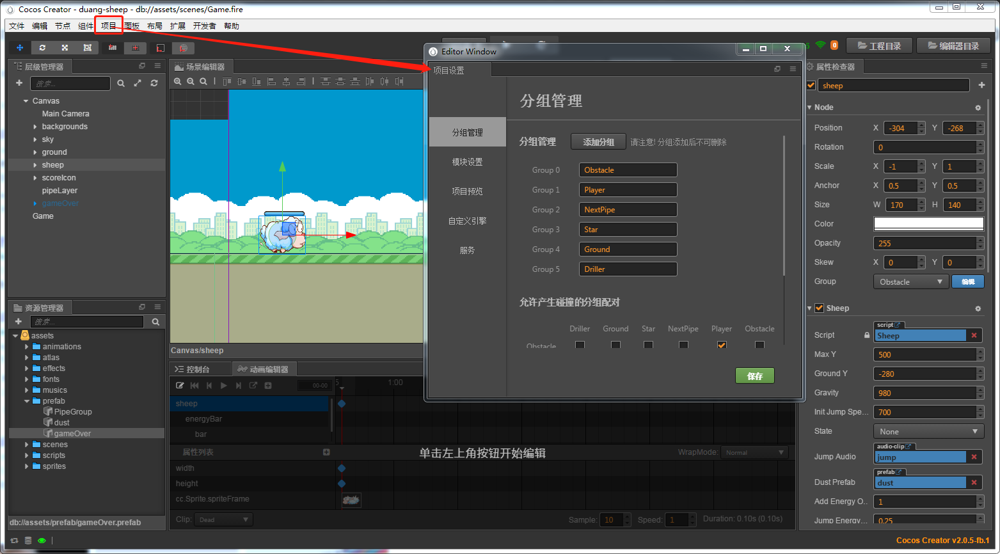
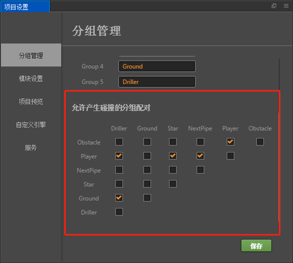
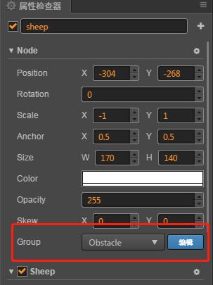
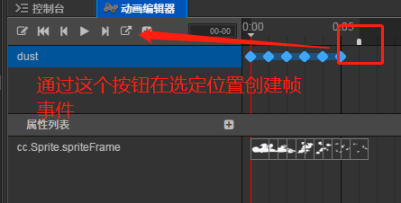

## Duang Sheep项目介绍:

这是一个类似 flappy bird 的小游戏，主人公为一只会飞的绵羊。玩家可以通过点击屏幕操作绵羊进行跳跃避免绵羊撞上障碍物,
越过一个障碍物可得一分，最后看看谁得到的分数最多。<br>

__游戏完成图：__<br>

---
## Git路径:

  >基础项目（资源）： https://github.com/cocos-creator/tutorial-duang-sheep/tree/step-1<br>
  >完整项目（资源 or 脚本）： https://github.com/cocos-creator/tutorial-duang-sheep/tree/master<br>
  
----
### Step4:
__本章重点：__ <br>
这一节进行我们需要做的事情比较多，主要是角色功能的完善。主要内容有以下几条:
- 绵羊的动画效果以及音效片段绑定
- 尘埃的动画效果
- 操控绵羊的跳跃以及能量条
- 场景现有物体之间的碰撞检测 <br>
__额外任务：__
- 无敌状态的场景移动加速，这个功能方便我们测试并查看整个游戏的流程体验。
---

1. 首先先来完善我们需要的动画效果以及音效片段的绑定。

通过 Creator 自带 __[动画编辑器](https://docs.cocos.com/creator/manual/zh/animation/)__ 进行动画编辑，将现有的 sheep 素材加入到我们创建的 AnimationClip 中。具体的 Clip 参数建议参考工程具体设置，当然你也可以根据实际的情况调整出符合自己需求的属性设置。


创建完成 sheep 自身需要的所有动作Run, Jump, Drop, DropEnd, Dead。
在这一步，我们创建了一张 atlas [图集](https://docs.cocos.com/creator/manual/zh/asset-workflow/atlas.html) 创建图集的具体原因这里不详细说明，与工程本身制作影响并不大，但是有兴趣的朋友可以尝试构建，仅用之前工程的图片足以创建出合适的动画片段，因此正在阅览教程的各位不强求创建图集。
2. 之后我们为了让动画更加的逼真，顺便制作一个新的 __dust__ 预制体（prefab）用于产生尘土的动画特效。
在对应的动画都调整完成之后，我们进行音效片段的绑定（详细设置参照工程）。
绑定音效之前我们要知道，在该项目中我们使用 __[cc.AudioEngione](https://docs.cocos.com/creator/manual/zh/audio/audio.html)__ 控制对应的音效，因此我们不需要创建 AudioSoucre 组件，而是直接使用脚本控制对应音效播放。

```
    // play bgMusic
    cc.audioEngine.playMusic(this.gameBgAudio);
```

3. 调整 sheep 对象，创建 energyBar 和 collider 两个子节点（详细属性设置参照工程内部）。
完成 sheep 的子节点创建后，在当前场景中再创建 Game 节点作为游戏管理器的绑定节点。

4. 创建 Sheep.js, CollisionProxy.js, GameManager.js, Dust.js

__Sheep.js__: 用于控制 sheep 角色的对应的动作，管理整个对象。<br>
因为 Sheep.js 代码比较多，下面针对重点进行解析。
```
// 注册监听事件， 这个事件用于监听键盘的敲击以及在游戏整体 Canvas 上的敲击事件。
  registeInput () {
        cc.systemEvent.on(cc.SystemEvent.EventType.KEY_DOWN, () => {
            this.jump();
        });
        
        this._canvas.on(cc.Node.EventType.TOUCH_START, () => {
            this.jump();
        });
    }
```
绵羊的跳跃动作正常实现方式有两种，一种是通过引擎集成的物理引擎属性给 Sheep 绑定 rigibody 赋予其一定的物理属性。之后通过施加作用力的方式产生跳跃的效果；第二种就是通过手写上下移动方式，手动赋予 Sheep 近似真实的物理效果。这个项目中我们使用的第二种方式，因为 Sheep 本身的动作并不多，手动赋予物理属性的方式具有更好的可操控性，也能减少项目组件依赖。

```
//-- 开始跳跃设置状态数据，播放动画
    jump: function () {
        if (this._energy >= this.jumpEnergyCost) {
            this._energy -= this.jumpEnergyCost;
            // 修改 sheep 状态
            this.state = State.Jump;
            this.currentSpeed = this.initJumpSpeed;
            // play the dust animation
            if (this.node.y <= this.groundY)
                this.spawnDust('DustUp');
            // play audio effect
            cc.audioEngine.playEffect(this.jumpAudio);
        }
        else {
            // play the refuse audio effect
            //cc.audioEngine.playEffect(D.game.dieAudio);
        }
    },
    // 在 _updateState 中根据 sheep 当前的属性判断它是否要继续下落
    // _updateState () {
    ····
    let flying = this.state === State.Jump || this.node.y > this.groundY;

        if (flying) {
            this.currentSpeed -= dt * this.gravity;
            this.node.y += dt * this.currentSpeed;
        }
        else {
            this._energy += this.addEnergyOnGroup * dt;
        }

        // update energy
        this._energy = cc.misc.clamp01(this._energy);
        this.energyBar.progress = this._energy;
    }
```
当前版本对原有动画播放做了较大的调整，但是从代码逻辑上看相对简单。
```
    //-- 更新绵羊动画
    _updateAnimation: function () {
        let animName = State[this._state];
        // temp
        this.anim.stop();
        this.anim.play(animName);
    },

    //-- 更新绵羊状态
    _updateState: function (dt) {
        switch (this.state) {
            case Sheep.State.Jump:
                if (this.currentSpeed < 0) {
                    this.state = State.Drop;
                }
                break;
            case Sheep.State.Drop:
                if (this.node.y <= this.groundY) {
                    this.node.y = this.groundY;
                    this.state = State.DropEnd;
                    this.spawnDust('DustDown');
                }
                break;
            case Sheep.State.DropEnd:
                if (this.anim.currentClip.name === 'DropEnd' && !this.anim.getAnimationState('DropEnd').isPlaying) {
                    this.state = State.Run;
                }
                break
            case Sheep.State.Dead: 
                break;
            default:
                break;
        }
      ······
```
控制动画播放的核心部分为 _updateAnimation 主要切换播放逻辑在 _updateState。<br>
这一节会为下一节的内容做个铺垫，因此会增加一个无敌状态的进入与退出函数声明，有能力的朋友可以进行尝试调整并实现这部分的功能，初学的朋友如果觉得过于复杂就暂时忽视就好。<br>
__CollisionProxy.js__: 碰撞检测的代理对象，绑定于碰撞节点中，实际作为代理对象执行真实对象碰撞函数。<br>
这里需要着重强调一下 Creator 提供的碰撞检测组件。
通过点击任务栏中 项目> 项目设置 打开分组管理界面。
 <br>
如图创建 6 个新的分组，并设置允许产生碰撞分组配对。
 <br>
我们通过调整 Node 组件上的 Group 属性确认各个节点对象的分组情况，而碰撞检测结果也会按照我们以上步骤设置的那样进行检测。<br>
 <br>
最后我们还需要在代码中设定碰撞检测功能为开启，因为 Creator 默认是不开启碰撞检测的。
```
    // 开启碰撞检测
    var manager = cc.director.getCollisionManager();
    manager.enabled = true;
```
__GameManager.js__: 游戏项目的管理类，目前我们只用来管理音频以及碰撞检测部分，整体的流程控制放在之后的步骤中进行。<br>
__Dust.js__: 控制灰尘的动画播放。
关于这个脚本内 finish 事件的绑定，需要注意，这个方法不是通过我们自定义代码调用，而是绑定在动画编辑器帧事件当中当播放执行到指定位置自动执行函数。
 <br>
1. 最后我们再顺手创建一个 gameOver 的面板放到场景中，用于以后我们控制游戏结束进程。
 <br>
6. 将脚本绑定到对应的节点上，进行测验至场景无报错正常跑通为止，这一步要求大家一步一步进行操作，__不要一口气将所有脚本以及属性设置完全__，建议设置完一个对象进行一次预览测试，保证当前对象的活动正常在进行下一步。

- Step3: https://github.com/cocos-creator/tutorial-duang-sheep/tree/step-3
- Step5: https://github.com/cocos-creator/tutorial-duang-sheep/tree/step-5