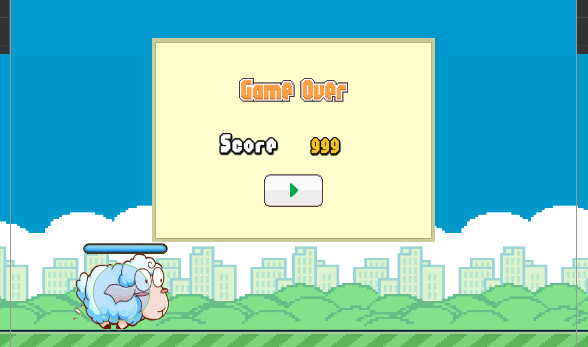

## Duang Sheep项目介绍:

这是一个类似 flappy bird 的小游戏，主人公为一只会飞的绵羊。玩家可以通过点击屏幕操作绵羊进行跳跃避免绵羊撞上障碍物,
越过一个障碍物可得一分，最后看看谁得到的分数最多。

游戏完成图：

---
## Git路径:

  >基础项目（资源): git@github.com:fireball-x/tutorial.git  
  >完整项目（资源or脚本: git@github.com:fireball-x/tutorial.git
  
----
### Step4:
这一节进行角色功能的完善，我们需要的功能有以下几条:
- 绵羊的动画效果以及音效片段绑定
- 尘埃的动画效果
- 操控绵羊的跳跃以及能量条
- 场景现有物体之间的碰撞检测 <br>
__额外任务：__
- 无敌状态的场景移动加速
---

1. 首先先来完善我们需要的动画效果以及音效片段的绑定。

通过 Creator 自带 __Animation__ 编辑组件进行动画编辑，将现有的 sheep 素材加入到我们创建的 AnimationClip 中。具体的 Clip 参数建议参考工程具体设置，当然你也可以根据实际的情况调整出符合自己需求的属性设置。


创建完成 sheep 自身的 Animation 之后我们为了让动画更加的逼真，顺便制作一个新的 __dust__ 预制体（prefab）用于产生尘土的动画特效。
在对应的动画都调整完成之后，我们进行音效片段的绑定（详细设置参照工程）。
绑定音效之前我们要知道，在该项目中我们使用 ```cc.AudioEngione``` 控制对应的音效，因此我们不需要创建 AudioSoucre 组件，而是直接使用脚本控制对应音效播放。

2. 调整 sheep 对象，创建 energyBar 和 collider 两个子节点（详细属性设置参照工程内部）。
完成 sheep 的子节点创建后，在当前场景中再创建 Game 节点作为游戏管理器的绑定节点。

3. 创建 Sheep.js, CollisionProxy.js, GameManager.js, Dust.js

__Sheep.js__: 用于控制 sheep 角色的对应的动作，管理整个对象，这一节中会为下一节的内容做个铺垫，因此会增加一个无敌状态的进入与退出函数声明，有能力的朋友可以进行尝试调整并实现这部分的功能，初学的朋友如果觉得过于复杂就暂时忽视就好。<br>
__CollisionProxy.js__: 碰撞检测的代理对象，绑定于碰撞节点中，实际作为代理对象执行真实对象碰撞函数。<br>
__GameManager.js__: 游戏项目的管理类，目前我们只用来管理音频以及碰撞检测部分，整体的流程控制放在之后的步骤中进行。<br>
__Dust.js__: 控制灰尘的动画播放。

4. 在这一步中我们再顺手创建一个 gameOver 的面板放到场景中，用于以后我们控制游戏结束进程。


5. 将脚本绑定到对应的节点上，进行测验至场景无报错正常跑通为止，这一步要求大家一步一步进行操作，__不要一口气将所有脚本以及属性设置完全__，建议设置完一个对象进行一次预览测试，保证当前对象的活动正常在进行下一步。
