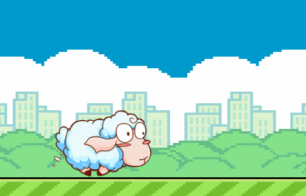

## Duang Sheep项目介绍:

这是一个类似 flappy bird 的小游戏，主人公为一只会飞的绵羊。玩家可以通过点击屏幕操作绵羊进行跳跃避免绵羊撞上障碍物,
越过一个障碍物可得一分，最后看看谁得到的分数最多。

__游戏完成图：__ <br>


---
## Git路径:

  >基础项目（资源）: https://github.com/cocos-creator/tutorial-duang-sheep/tree/step-1<br>
  >完整项目 （资源 or 脚本）: https://github.com/cocos-creator/tutorial-duang-sheep/tree/master<br>
  
---
在上一步 Step1 中我们导入了整个项目需要的基本资源，接下来我们就要开始学习整个游戏项目的制作了。怀着激动的心情，我先来讲述一下这个教程的进阶流程以及你需要的前期准备工作。
首先，整个项目是按照循序渐进的模式逐步加大教学难度，如果你是 __未接触过__ creator 的新手，请务必按照每一步的流程 __成功跑通__ 之后再进行下一步的学习，避免囫囵吞枣和急功近利，若是在学习过程中发现实在晦涩难懂建议从更加初级的 __[小星星](https://docs.cocos.com/creator/manual/zh/getting-started/quick-start.html)__ 教程入手。<br>
其次，每一步的教学内容都会附带一个教学重心点，整个流程会告诉你 creator 现有的 __大部分基础组件__ 的使用方法，希望通过完成这些教程内容，能够帮助你快速入门 creator。<br>

在学习之前你最好需要具备以下几种技能，基础的 __JS__ 编写能力，基本的游戏设计理念，基本的 __程序框架设计__ 能力，__重构__ 的概念，耐心，细心和决心。

### Step2:

__本章重点：__
场景制作，自定义脚本编写以及节点绑定自定义脚本。
这一节我们只构建好初始的场景并且实现一个简单的功能——场景的滚动播放。

1. 在资源管理器内单机右键创建新场景并命名为 Game。
   布置场景，创建几个基本节点如图：
    <br>
   bgBlue 和 bgBrown 是 __Sprite__ 组件(纯色)节点。<br>
   你可以通过修改 Node 组件上方 Color 属性改变 Sprite 的显示颜色。
   <br>
   初始化后场景如下图（详细配置参照项目工程）。
<br>

2. 基本场景创建完成之后，我们添加两个新的组合节点，sky 和 ground，它们两个包含对应名称的 sprite 节点对象。
   <br>
   <br>
3. 场景创建完毕，我们需要在资源管理器内单击右键，创建一个新的 JavaScript 脚本，命名为 ScrollPicture，脚本内容如下。
```
    var ScrollPicture = cc.Class({
        //-- 继承
        extends: cc.Component,
        //-- 属性
        properties: {
            //-- 滚动的速度
            speed:200,
            //-- X轴边缘
            resetX: 0
        },
        //-- 更新
        update: function (dt) {
            this.node.x += dt * this.speed;
            if (this.node.x < this.resetX) {
                this.node.x -= this.resetX;
            }
        }
    });
```  
   如果对里面的脚本内容设置不够了解的话，建议参考: [脚本开发指南](https://docs.cocos.com/creator/manual/zh/scripting/)。
   这个脚本功能是用于控制背景画面的移动，我们需要将它从资源管理器中拖拽脚本对象绑定到 sky 和 ground 这两个父节点上。<br>
<br>
4. 将 ScrollPicture.js 绑定到对应父节点上，并且按照合适的速度调整地面移动速度，最后我们算是初步完成了场景的搭建任务。<br>

<br>

- Step3: https://github.com/cocos-creator/tutorial-duang-sheep/tree/step-3